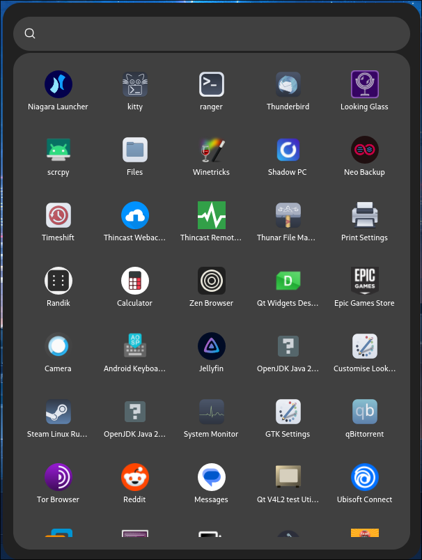

<div align="center">

# Void Launcher

**Void Launcher** is a modern, sleek, fast and customizable app launcher built with GTK4 and Rust.

</div>

- **Responsive layout** that adapts column count and icon size to window width
- **Fuzzy search with keywords support** for fast and smart app discovery
- **Customizable CSS themes** with separate dark/light modes and override support
- **Smooth startup and exit animations** with optional toggle in config
- **Built-in configuration** via JSON for behavior and appearance tweaks
- **GNOME-inspired design** with polished visuals and clean UI
- **Lightweight and fast** — written in pure Rust with zero runtime bloat

<div align="center">
</image>
</div>

[Installation](#installation) •
[Configuration](#configuration) •
[Usage](#usage)

## Installation

Void Launcher requires GTK >= 4.16. For Arch based distros, you will need
`gtk4`, Debian based distros will need `libgtk-4-dev`, and Fedora
based distros will need `gtk4-devel`.

Additionally, you will need `cargo` and `make` for compiling the project.

Void Launcher was developed on Rust `1.87.0` however,
lower versions of Rust should still work.

Run the following commmand to build and install Void Launcher:

```bash
git clone https://github.com/mistrmochov/void-launcher
make
sudo make install
```
This will place Void Launcher binary in `/usr/bin` and the images into `/usr/share/void-launcher`.

If you want to clean build files run:
```bash
make clean
```

If you wish to uninstall Void Launcher run the following command in the repo's directory:

```bash
sudo make uninstall
```

## Usage

Simply run the void-launcher binary.

Adding it to bind in Hyprland would look like this:

```conf
bind = $mainMod, SPACE, exec, void-launcher
```

Other desktop environments or window managers should be similar.

## Configuration

All these configurations are in `~/.config/void-launcher/config.json` file. This file is automatically generated, when non existent!

By default, Void Launcher uses the `"top"` layer in layer-shell. This can be changed to `bottom` or `overlay`.

You can turn on or off fullscreen mode by changing the `"fullscreen"` option to `"true"` or `"false"`.

The `"input"` option can be changed to `"exclusive"` to make keyboard mode in layer shell exclusive or to `"on-demand"`. Mostly the `"exclusive"` option will be what you want to use, the `"on-demand"` option is there for people, who use touch device with on screen keyboard.

Options `"width"` and `"height"` will change width and height of the window, however when fullscreen mode is on, these options will do nothing.

The `"columns"` options controls the number of the columns, you can put there any number you like, that is bigger then 1 or leave it to `"auto"` and let the app adjust dynamically based on the size of the window.

You can change size of icons by changing the `"icon_size"` option. This can be any number between 20 and 80 or leave it to `"auto"`, then it will adjust automatically.

The options `"background-color"`, `"accent-color"` and `"select-color"` control colors of the app. The color has to be in hex color code format or leave to `"default"`.

You can also control startup and exit animations with these options: `"start-animation"`, `"exit-animation"`. You can set them to `"true"` or `"false"`.

If you wish to override the actual CSS, you can create `"~/.config/void-launcher/style.css"` and it will append your styling to the internal CSS.